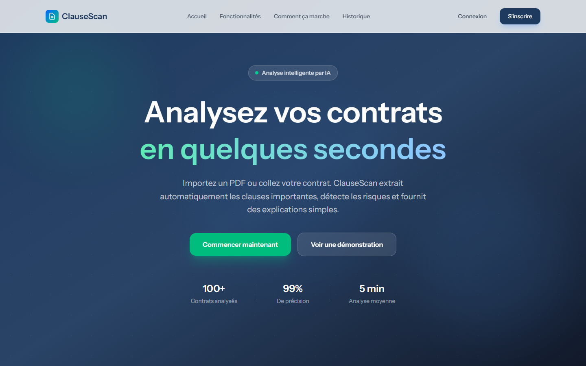
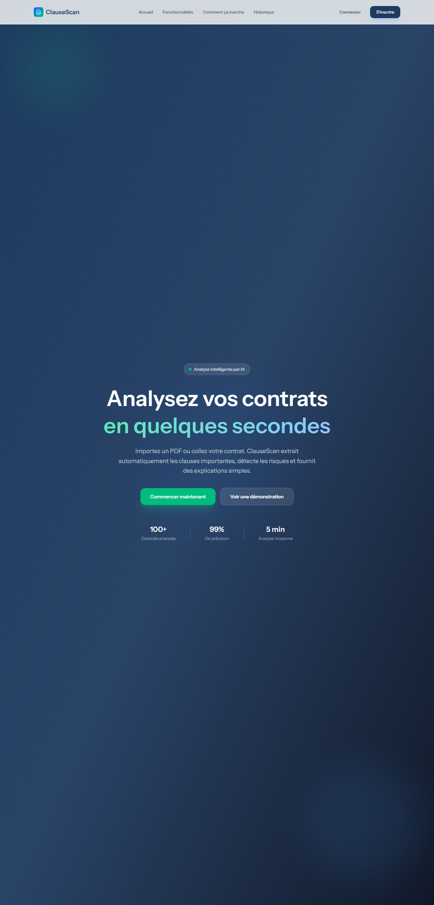
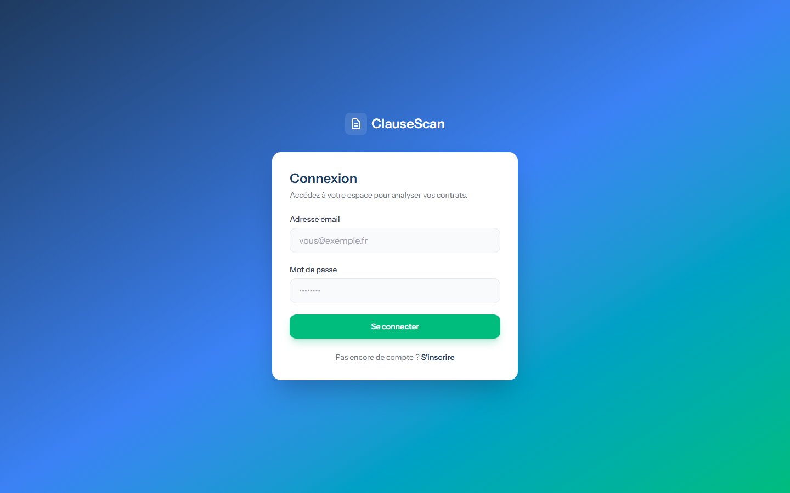
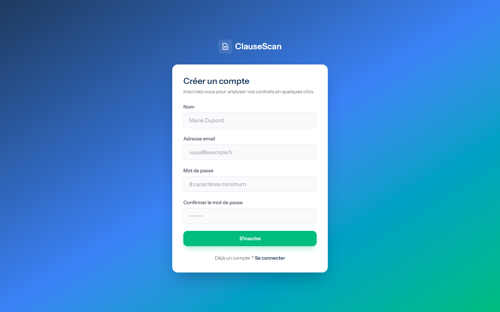
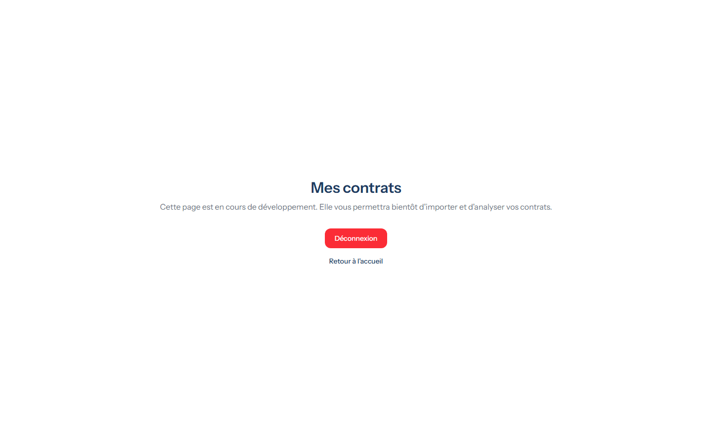

<div align="center">

# ClauseScan 🔍

**Analysez vos contrats en quelques secondes grâce à l'intelligence artificielle**


</div>

---

## 📖 À propos

**ClauseScan** est une application web full-stack qui utilise l'intelligence artificielle pour analyser des contrats juridiques — baux de location, contrats de prestation freelance, etc. Elle extrait les informations importantes, détecte les clauses à risque et les explique en langage simple.

| | |
|---|---|
| **Objectif** | Aider les non-juristes (locataires, freelances, propriétaires) à comprendre leurs contrats avant de les signer |
| **Type de projet** | API REST (Laravel) + SPA (React) — projet de fin de formation **Laravel AI Augmented Backend Developer** |
| **IA** | Analyse asynchrone via l'API OpenRouter (sortie JSON structurée garantie par schéma) |

## 👀 Aperçu

ClauseScan est une application basée sur une **API REST Laravel** enrichie par l'IA, avec un **frontend React** moderne. L'utilisateur importe un contrat (fichier **PDF** ou **texte collé**) ; celui-ci est envoyé dans une **file d'attente** (Job) qui appelle un modèle d'IA pour extraire la durée, le préavis, les pénalités, les conditions de résiliation et les clauses à risque. Le résultat structuré est stocké en base et consultable, avec possibilité de **télécharger un rapport PDF**.

Le public cible : **locataires et futurs locataires** (vérifier un bail), **freelances** (contrats de prestation) et **propriétaires ou clients** (s'assurer de la clarté et de l'équilibre d'un contrat). L'application fournit une analyse simple et rapide des principales clauses — sans remplacer les conseils d'un professionnel du droit.

## ✨ Fonctionnalités

| # | Fonctionnalité | Statut |
|---|---|---|
| 1 | Création de compte (nom, email, mot de passe) | ✅ Implémenté |
| 2 | Connexion / Déconnexion sécurisée (Bearer token) | ✅ Implémenté |
| 3 | Import d'un contrat au format **PDF** (extraction automatique du texte) | ✅ Implémenté (API) |
| 4 | Envoi d'un contrat **sous forme de texte** | ✅ Implémenté (API) |
| 5 | Liste des contrats de l'utilisateur | ✅ Implémenté (API) |
| 6 | Suppression d'un contrat (fichier inclus) | ✅ Implémenté (API) |
| 7 | Lancement d'une **analyse IA asynchrone** (Job + Queue, réponse 202) | ✅ Implémenté (API) |
| 8 | Extraction des clauses principales : durée, préavis, pénalités, résiliation | ✅ Implémenté (API) |
| 9 | Détection du **niveau de risque** de chaque clause (low / medium / high) | ✅ Implémenté (API) |
| 10 | Explication des clauses en langage simple | ✅ Implémenté (API) |
| 11 | Historique des analyses | ✅ Implémenté (API) |
| 12 | Consultation détaillée d'une analyse + ses clauses | ✅ Implémenté (API) |
| 13 | **Téléchargement d'un rapport d'analyse PDF** (DomPDF) | ✅ Implémenté (API) |
| 14 | Accès sécurisé : chaque utilisateur ne voit que ses données (Policies) | ✅ Implémenté |
| 15 | Frontend React : landing page, connexion, inscription | ✅ Implémenté |
| 16 | Frontend : dashboard, upload, historique, profil | 🚧 En cours de développement |
| 17 | Choix de la langue des résultats | 🔜 Roadmap |

## 🧰 Technologies utilisées

### Frontend

| Technologie | Rôle |
|---|---|
| **React 19** + Vite 8 | Interface utilisateur (SPA) |
| **React Router 7** | Routage côté client |
| **Axios** | Client HTTP (intercepteurs token + 401) |
| **React Hook Form** | Gestion des formulaires |
| **Zod** | Validation des formulaires (schémas partagés) |
| **Tailwind CSS 4** | Styles utilitaires + thème (`@theme`) |
| **Vitest** + Testing Library | Tests unitaires frontend (29 tests) |

### Backend

| Technologie | Rôle |
|---|---|
| **Laravel 13** (PHP 8.4) | API REST |
| **Laravel Sanctum 4** | Authentification par token (Bearer) |
| **MySQL** | Base de données |
| **Laravel Jobs & Queues** (database) | Analyse IA asynchrone (`AnalyzeContractJob`) |
| **OpenRouter API** | Analyse IA avec **structured output** (JSON Schema) |
| **Spatie PDF-to-Text** | Extraction du texte des PDF importés |
| **DomPDF (barryvdh)** | Génération des rapports PDF |
| **PHPUnit** | Tests Feature (auth, contrats, analyses, job) |

## 🏗️ Architecture du projet

```
clauseScan/
├── app/
│   ├── Casts/                 # Casts Eloquent (AnalysisResultCast)
│   ├── Http/
│   │   ├── Controllers/       # AuthController, ContractController, AnalysisController
│   │   ├── Requests/          # Validation des entrées (Register, Login, StoreContract)
│   │   └── Resources/         # API Resources (User, Contract, Analysis, Clause)
│   ├── Jobs/                  # AnalyzeContractJob (file d'attente)
│   ├── Models/                # User, Contract, Analysis, Clause
│   ├── Policies/              # Authorization (ContractPolicy, AnalysisPolicy)
│   ├── Providers/             # AppServiceProvider, AuthServiceProvider
│   └── ValueObjects/          # AnalysisResult, ClauseItem (résultat IA typé)
├── config/                    # Configuration (ai.php, sanctum, ...)
├── database/
│   └── migrations/            # Schéma MySQL (users, contracts, analyses, clauses, tokens)
├── resources/
│   ├── css/app.css            # Tailwind v4 + thème de couleurs
│   ├── js/src/                # Frontend React
│   │   ├── components/        # Navbar, Hero, Features, HowItWorks, Benefits, CTA, Footer
│   │   ├── features/auth/     # AuthContext, schémas Zod
│   │   ├── lib/               # Client Axios, gestion de session (localStorage)
│   │   └── pages/             # LandingPage, LoginPage, RegisterPage
│   └── views/                 # welcome.blade.php, rapports/analysis.blade.php
├── routes/
│   ├── api.php                # Routes de l'API REST
│   └── web.php                # Catch-all → SPA React
├── tests/                     # Tests PHPUnit (Feature)
└── docs/screenshots/          # Captures d'écran du README
```

### Pipeline d'analyse IA

```
Utilisateur → POST /api/contracts/{id}/analyze (202 Accepted)
    → Analysis (status: pending) créée en base
    → AnalyzeContractJob dispatché dans la file d'attente
    → Job appelle OpenRouter (JSON Schema strict)
    → Résultat validé → Clauses stockées + Analysis.status = done
    → Consultable via GET /api/analyses/{id} et exportable en PDF
```

## 🚀 Installation

### Prérequis

- PHP ≥ 8.3, Composer
- MySQL (ou SQLite pour un test rapide)
- Node.js ≥ 20, npm

### 1. Backend (Laravel)

```bash
# Installation rapide (tout-en-un) :
composer setup

# — ou étape par étape —
composer install
cp .env.example .env
php artisan key:generate

# Configurer .env : base de données MySQL + clé OpenRouter (voir section ci-dessous)

php artisan migrate
php artisan serve          # API sur http://127.0.0.1:8000
php artisan queue:work     # worker de la file d'attente (indispensable pour l'IA)
```

### 2. Frontend (React)

```bash
npm install
npm run dev     # développement (Vite HMR)
npm run build   # production (build dans public/build)
```

### 3. Mode développement combiné

```bash
composer run dev   # lance serveur + queue + logs + Vite simultanément
```

### Tests

```bash
php artisan test    # tests backend (PHPUnit)
npm test            # tests frontend (Vitest)
```

## ⚙️ Variables d'environnement

| Variable | Description | Exemple |
|---|---|---|
| `APP_NAME` | Nom de l'application | `ClauseScan` |
| `APP_URL` | URL de base | `http://localhost` |
| `APP_ENV` / `APP_DEBUG` | Environnement / débogage | `local` / `true` |
| `DB_CONNECTION` | Type de base de données | `mysql` |
| `DB_HOST`, `DB_PORT` | Hôte et port MySQL | `127.0.0.1`, `3306` |
| `DB_DATABASE` | Nom de la base | `clausescan` |
| `DB_USERNAME`, `DB_PASSWORD` | Identifiants MySQL | `root` |
| `QUEUE_CONNECTION` | Driver de file d'attente | `database` |
| `OPENROUTER_API_KEY` | **Clé API OpenRouter** (analyse IA) | `sk-or-...` |
| `OPENROUTER_MODEL` | Modèle IA utilisé | `openai/gpt-4o-mini` |
| `OPENROUTER_ENDPOINT` | Endpoint IA (défaut OpenRouter) | `https://openrouter.ai/api/v1/chat/completions` |
| `OPENROUTER_TIMEOUT` | Délai d'attente de l'IA (s) | `120` |
| `VITE_API_URL` | URL de l'API vue par le frontend | `http://localhost:8000/api` |

> ⚠️ `.env` ne doit **jamais** être commité. La clé API ne circule que côté serveur.

## 🔌 API

Toutes les routes sont préfixées par `/api`. Les routes protégées exigent le header `Authorization: Bearer {token}`.

### Authentification

| Méthode | Route | Description |
|---|---|---|
| `POST` | `/api/register` | Créer un compte → renvoie l'utilisateur + token (201) |
| `POST` | `/api/login` | Connexion → renvoie l'utilisateur + token (200) |
| `POST` | `/api/logout` | Déconnexion, révoque le token courant (204) |
| `GET` | `/api/user` | Utilisateur connecté |

### Contrats

| Méthode | Route | Description |
|---|---|---|
| `GET` | `/api/contracts` | Liste des contrats de l'utilisateur (paginée) |
| `POST` | `/api/contracts` | Import d'un contrat — `content` (texte) **ou** `contract` (fichier PDF) (201) |
| `DELETE` | `/api/contracts/{contract}` | Suppression du contrat + son fichier (204) |
| `POST` | `/api/contracts/{contract}/analyze` | Lance l'analyse IA asynchrone (**202 Accepted**) — 409 si une analyse est déjà en cours |

### Analyses

| Méthode | Route | Description |
|---|---|---|
| `GET` | `/api/analyses` | Historique des analyses de l'utilisateur (paginé) |
| `GET` | `/api/analyses/{analysis}` | Détail d'une analyse (+ clauses si terminée) |
| `GET` | `/api/analyses/{analysis}/report` | **Téléchargement du rapport PDF** (DomPDF) |

### Exemple — Lancer une analyse

```bash
curl -X POST http://127.0.0.1:8000/api/contracts/1/analyze \
  -H "Authorization: Bearer {token}" \
  -H "Accept: application/json"
# → 202 Accepted : {"data": {"id": 3, "status": "pending", ...}}
```

## 🔐 Authentification (Sanctum)

L'authentification repose sur **Laravel Sanctum** :

1. `POST /api/register` ou `/api/login` renvoie un **token en clair** (`plainTextToken`) stocké côté client dans `localStorage` (`clausescan_token`, `clausescan_user`).
2. Le client Axios ajoute automatiquement le header `Authorization: Bearer <token>` sur chaque requête (intercepteur de requête dans `resources/js/src/lib/api.js`).
3. Les routes protégées sont groupées sous le middleware `auth:sanctum` ; une réponse **401** vide automatiquement la session et redirige vers la page de connexion.
4. Chaque accès est vérifié par des **Policies** (`ContractPolicy`, `AnalysisPolicy`) : un utilisateur ne peut consulter, analyser ou supprimer que ses propres données.
5. `POST /api/logout` révoque le token courant côté serveur.

## 📸 Captures d'écran

### Accueil



Page d'accueil : hero avec dégradé bleu, présentation de l'application et bouton d'inscription.

### Accueil — vue complète



Vue complète de la landing page : fonctionnalités, étapes, avantages, appel à l'action et footer.

### Connexion



Formulaire de connexion (email + mot de passe) avec validation Zod et gestion des erreurs serveur (401 / 422).

### Inscription



Formulaire d'inscription : nom, email, mot de passe et confirmation, avec validation en temps réel.

### Mes contrats



Page "Mes contrats" (actuellement un placeholder). Le backend associé est prêt : liste, import PDF/texte, suppression et lancement d'analyse.

> 📌 Les pages **Dashboard**, **Upload de contrat**, **Résultat d'analyse IA**, **Historique**, **Profil** et **404** seront ajoutées dans les prochaines itérations du frontend — leurs endpoints API sont déjà opérationnels.

## ✅ Bonnes pratiques & choix techniques

| Choix | Justification |
|---|---|
| **API REST + API Resources** | Réponse JSON cohérente et typée (User, Contract, Analysis, Clause) |
| **Jobs & Queues (asynchrone)** | L'appel IA est lent : réponse immédiate **202 Accepted**, traitement en arrière-plan (`AnalyzeContractJob`) |
| **Structured output IA** | JSON Schema strict côté OpenRouter + validation applicative + **Casts/ValueObjects** (résultat typé, jamais de JSON brut non contrôlé) |
| **Form Requests** | Validation centralisée (register, login, store contract : taille PDF, types) |
| **Policies** | Autorisations explicites et par-ressource, isolation stricte des données utilisateurs |
| **Sanctum Bearer tokens** | Authentification stateless, révocable à la déconnexion |
| **Eloquent** | Protection contre les injections SQL ; données jamais exposées en clair (mots de passe bcrypt) |
| **Validation double couche** | Zod côté frontend + validation Laravel côté backend |
| **Tests automatisés** | 13 fichiers PHPUnit côté API (endpoints, protection 401, validation 422, dispatch de job) + 29 tests Vitest côté frontend |

## 🗺️ Roadmap

- [ ] Pages frontend : dashboard, upload PDF, résultats d'analyse, historique, profil
- [ ] Intégration du rapport PDF dans l'interface
- [ ] Choix de la langue des résultats (bonus)
- [ ] CI GitHub Actions (tests + Pint à chaque push)
- [ ] Docker (Dockerfile + docker-compose)
- [ ] Déploiement Azure (ou Railway / Render / Fly.io)
- [ ] Documentation d'API (Scribe / Swagger)

## 👩‍💻 Auteure

**Zineb Akarras** — Développeuse Full Stack

Projet réalisé dans le cadre d'une formation **Laravel AI Augmented Backend Developer** (DWWM / Backend).

📂 Repository : [github.com/zineb-AK/clauseScan](https://github.com/zineb-AK/clauseScan)

## 📄 Licence

Ce projet est distribué sous la **licence MIT**.

```
MIT License

Copyright (c) 2026 Zineb Akarras

Permission is hereby granted, free of charge, to any person obtaining a copy
of this software and associated documentation files (the "Software"), to deal
in the Software without restriction, including without limitation the rights
to use, copy, modify, merge, publish, distribute, sublicense, and/or sell
copies of the Software, and to permit persons to whom the Software is
furnished to do so, subject to the following conditions:

The above copyright notice and this permission notice shall be included in all
copies or substantial portions of the Software.

THE SOFTWARE IS PROVIDED "AS IS", WITHOUT WARRANTY OF ANY KIND, EXPRESS OR
IMPLIED, INCLUDING BUT NOT LIMITED TO THE WARRANTIES OF MERCHANTABILITY,
FITNESS FOR A PARTICULAR PURPOSE AND NONINFRINGEMENT. IN NO EVENT SHALL THE
AUTHORS OR COPYRIGHT HOLDERS BE LIABLE FOR ANY CLAIM, DAMAGES OR OTHER
LIABILITY, WHETHER IN AN ACTION OF CONTRACT, TORT OR OTHERWISE, ARISING FROM,
OUT OF OR IN CONNECTION WITH THE SOFTWARE OR THE USE OR OTHER DEALINGS IN THE
SOFTWARE.
```
